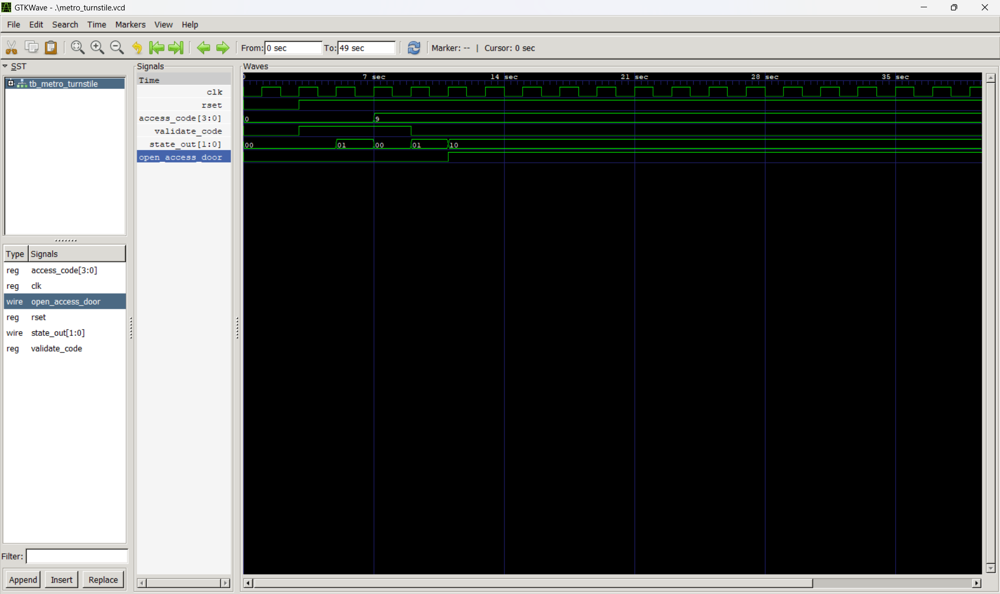

# 🚇 Metro Turnstile FSM

## Overview
This project implements a **Metro Turnstile Access Control System** using a **Finite State Machine (FSM)** in **Verilog**.  
The system simulates the logic of a metro gate that opens only when a valid access code is entered.  
It remains open for a short duration before automatically locking again.

---

## Tools Used
- **Icarus Verilog (iverilog)** – Simulation  
- **VS Code** – Code editing  
- **GTKWave** – Waveform visualization  

---

## Functional Description

| **State** | **Description** | **Condition / Action** | **Next State** |
|------------|----------------|------------------------|----------------|
| **IDLE** | Waiting for user input | Waits for `validate_code = 1` | CHECK_CODE |
| **CHECK_CODE** | Verifies access code | If `access_code` between `4` and `11` → access granted | ACCESS_GRANTED |
| **ACCESS_GRANTED** | Gate open | Door open for 15 clock cycles | IDLE |

---

##  Design Highlights
- **3-State FSM (IDLE, CHECK_CODE, ACCESS_GRANTED)**  
- **Access verification logic** based on a numeric range (4–11)  
- **Automatic door close** after timer expires  
- **Asynchronous active-low reset (`rset`)**  
- **One clock-based timing mechanism** for simplicity  

---

##  Simulation Output
Below is the waveform generated from the simulation showing the state transitions and door control signal:

---
## output

                   0 access_code = 0000,state_out = 00, open_access_door = 0
                   5 access_code = 0000,state_out = 01, open_access_door = 0
                   7 access_code = 1001,state_out = 00, open_access_door = 0
                   9 access_code = 1001,state_out = 01, open_access_door = 0
                  11 access_code = 1001,state_out = 10, open_access_door = 1
                  13 access_code = 1001,state_out = 10, open_access_door = 1
                  15 access_code = 1001,state_out = 10, open_access_door = 1
                  17 access_code = 1001,state_out = 10, open_access_door = 1
                  19 access_code = 1001,state_out = 10, open_access_door = 1
                  21 access_code = 1001,state_out = 10, open_access_door = 1
                  23 access_code = 1001,state_out = 10, open_access_door = 1
                  25 access_code = 1001,state_out = 10, open_access_door = 1
                  27 access_code = 1001,state_out = 10, open_access_door = 1
                  29 access_code = 1001,state_out = 10, open_access_door = 1
                  31 access_code = 1001,state_out = 10, open_access_door = 1
                  33 access_code = 1001,state_out = 10, open_access_door = 1
                  35 access_code = 1001,state_out = 10, open_access_door = 1
                  37 access_code = 1001,state_out = 10, open_access_door = 1
                  39 access_code = 1001,state_out = 10, open_access_door = 1
                  41 access_code = 1001,state_out = 10, open_access_door = 1
                  43 access_code = 1001,state_out = 00, open_access_door = 0

---

## Key Learnings
- FSM-based access control system design  
- Timer-controlled state transitions  
- Input validation logic in Verilog  
- Asynchronous reset and signal handling  

---

## ✅ Conclusion
The **Metro Turnstile FSM** successfully demonstrates an access-controlled gate mechanism,  
ensuring secure and timed entry using simple and efficient **FSM-based digital design** principles in Verilog.
